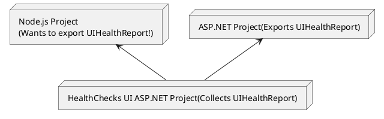

## Overview

This package aims to provide output similar to the AspNetCore.Diagnostics.HealthChecks 6.\* package in NuGet.

## Motivation

When operating containerized applications, configuring health checks becomes essential. Health checks are supported in various operational environments, and while the HTTP status code rules are generally consistent, the payload schema can vary depending on the environment.

In my own experience, I frequently develop APIs using ASP.NET, and in such cases, I typically combine AspNetCore.Diagnostics.HealthChecks with HealthChecksUI for configuring and monitoring health checks.

As I have been working more with Node.js recently, I decided to develop this package to enable handling the output of AspNetCore.Diagnostics.HealthChecks in Node.js.



## Install

`npm install @appsightnet/nodejs-aspnet-healthz`

## Usage

```ts
// Create HealthCheckService instance
const options: HealthCheckServiceOptions = {
  registrations: [
    {
      name: 'healthy-0',
      instance: new StubHealthCheck('Healthy'),
      tags: ['liveness'],
    },
  ],
}
const healthCheckService = new DefaultHealthCheckService(options)

// Perform checks
const healthReport = await healthCheckService.checkHealthAsync()

// Export UIHealthReport json
const uiHealthReport = UIHealthReportUtils.fromHealthReport(healthReport)
console.log(JSON.stringify(uiHealthReport))
```

```json
{
  "status": "Healthy",
  "totalDuration": "00:00:00.000",
  "entries": {
    "healthy-0": {
      "status": "Healthy",
      "description": "healthy-0 is Healthy!",
      "duration": "00:00:00.000",
      "tags": ["liveness"]
    }
  }
}
```

## API Reference

TBD

## Options

### Perform only readiness checks

```ts
const healthReport = await healthCheckService.checkHealthAsync((predicate) =>
  predicate.tags.includes('readiness')
)
```

### Set timeout per registration

```ts
const options: HealthCheckServiceOptions = {
  registrations: [
    {
      name: 'healthy-0',
      instance: new StubHealthCheck('Healthy'),
      tags: ['liveness'],
      timeoutMilliseconds: 1000,
    },
    {
      name: 'healthy-1',
      instance: new StubHealthCheck('Healthy'),
      tags: ['liveness'],
      timeoutMilliseconds: 2000,
    },
  ],
}
const healthCheckService = new DefaultHealthCheckService(options)
```

### Set overall timeout for checks

```ts
const healthReport = await healthCheckService.checkHealthAsync(
  (predicate) => predicate.tags.includes('readiness'),
  30000 // 30 seconds
)
```

## Change Log

TBD

## Acknowledgements

- Special thanks to all contributors to [AspNetCore.Diagnostics.HealthChecks]([https://github.com/Xabaril/AspNetCore.Diagnostics.HealthChecks]), which served as a valuable reference for this project.
